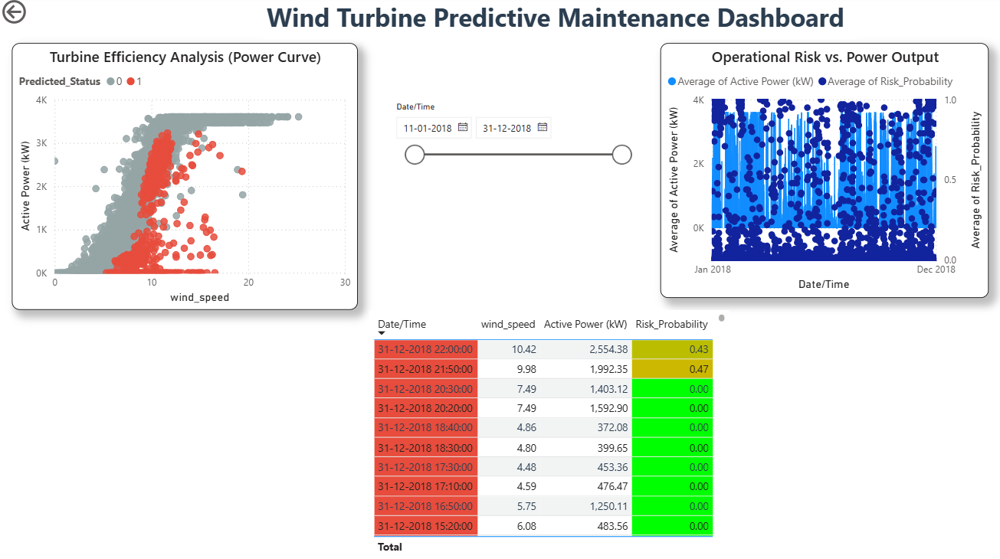

# Wind Turbine Predictive Maintenance & Fault Detection


## 📌 Executive Summary
This project delivers an end-to-end **Predictive Maintenance Solution** designed to reduce unplanned downtime for wind turbines. By analyzing SCADA data using **Random Forest Classifiers**, the model predicts potential failures **10-30 minutes in advance** with **96% Accuracy**.

The solution includes an interactive **Power BI Command Center** that translates model predictions into actionable financial insights, estimating potential savings of **$1,500 per prevented incident**.

## 🚀 Key Features
* **Temporal Feature Engineering:** Utilized Lag Features and Rolling Averages to capture the "history" of turbine behavior, significantly outperforming standard static models.
* **High-Precision AI:** Achieved **96% Accuracy** and **98% ROC-AUC**, minimizing costly false alarms.
* **Financial ROI Analysis:** integrated a cost-benefit framework to quantify the value of proactive repairs vs. reactive fixes.
* **Root Cause Fingerprinting:** Identifies primary drivers of failure (e.g., Wind Speed vs. Power Output deviation).

## 📊 Dashboard Preview
*(Upload your Power BI Screenshot here and replace this line)*
> The dashboard provides real-time "Traffic Light" risk alerts for fleet operators.

## 🛠️ Tech Stack
* **Language:** Python (Pandas, NumPy, Scikit-Learn)
* **Visualization:** Power BI (DAX, Interactive Dashboards), Matplotlib, Seaborn
* **Machine Learning:** Random Forest Classifier (Ensemble Learning)



## 📂 Project Structure
```text
├── data/          # Raw SCADA data (Wind Speed, Power, Direction)
├── notebooks/     # Jupyter Notebooks for EDA, Feature Engineering & Modeling
├── outputs/       # Final Risk Predictions (CSV)
├── PowerBI/       # Interactive Dashboard (.pbix)
└── requirements.txt
